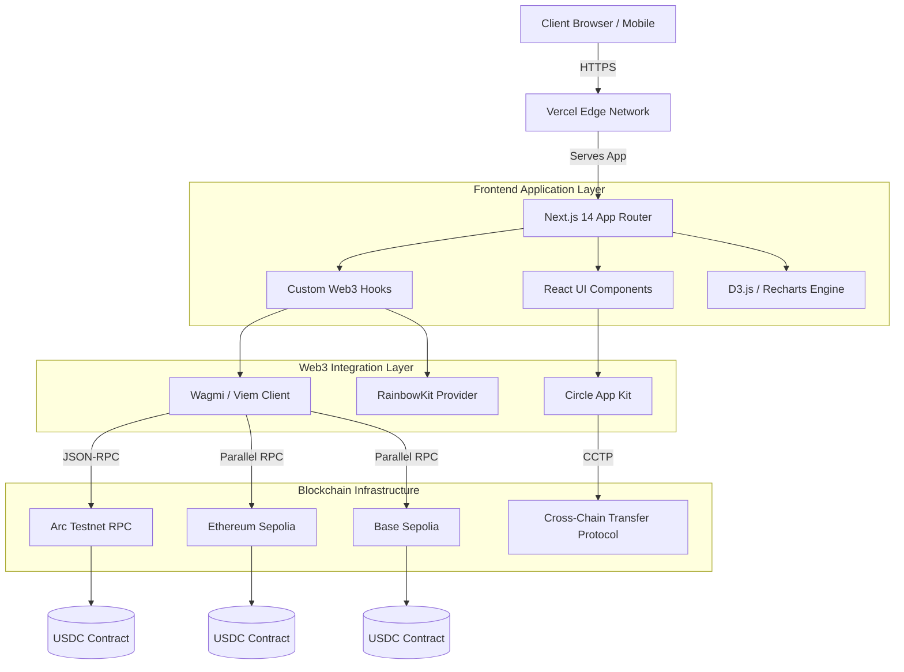
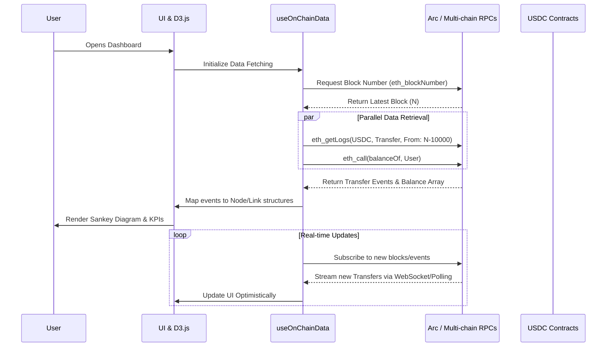
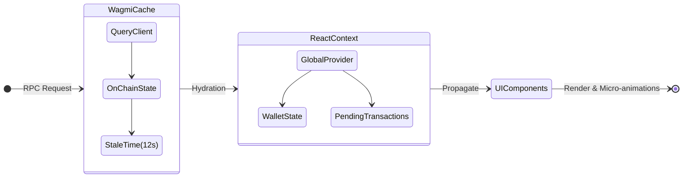
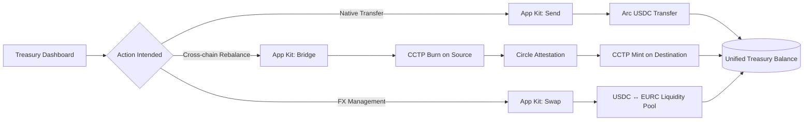

<div align="center">
  
  <h1>CashFlow360</h1>
  <p><strong>Analytics-first Cash Flow Intelligence Platform for SMEs</strong></p>
  <p>
    An institutional-grade, on-chain cash flow management platform built on the Arc network. CashFlow360 provides real-time analytics, predictive forecasting, and cross-chain treasury management — entirely powered by Circle's developer stack and the stablecoin commerce ecosystem.
  </p>
  <p>
    <a href="https://nextjs.org/"></a>
    <a href="https://www.typescriptlang.org/"></a>
    <a href="https://arc.circle.com/"></a>
    <a href="https://circle.com/"></a>
  </p>
</div>

<br />

## 📖 Table of Contents

- [Overview](#-overview)
- [Architecture & System Design](#-architecture--system-design)
  - [High-Level System Topology](#1-high-level-system-topology)
  - [Data Pipeline & Event Processing](#2-data-pipeline--event-processing)
  - [State Management & Caching](#3-state-management--caching)
  - [Cross-Chain Treasury Flow](#4-cross-chain-treasury-flow)
- [Technical Decisions & Tradeoffs](#-technical-decisions--tradeoffs)
- [Folder & Module Responsibilities](#-folder--module-responsibilities)
- [Key Features](#-key-features)
- [Integration with Circle Products](#-integration-with-circle-products)
- [Getting Started](#-getting-started)

---

## 🎯 Overview

**Track 2: SME Finance & Trade Workflows** — The Stablecoins Commerce Stack Challenge.

CashFlow360 replaces legacy banking portals with a purely on-chain, non-custodial treasury dashboard. By utilizing USDC as the native gas token on Arc and eliminating centralized databases, the platform achieves **zero-latency reconciliation**, **100% cryptographic verifiability**, and **programmable capital flows**. 

All visualizations, including real-time Sankey cash flow maps and multi-chain radar charts, are derived deterministically from indexed blockchain events, leaving zero room for mock data or phantom balances.

---

## 🏗 Architecture & System Design

CashFlow360 is built using a modern, stateless edge architecture. It bypasses traditional Web2 backend infrastructure (like relational databases or caching servers) in favor of direct, client-to-RPC communication. The Next.js React application acts as a rich client that directly queries, aggregates, and visualizes on-chain state.

### 1. High-Level System Topology



**What this represents:** The macro architecture of CashFlow360, highlighting the stateless frontend communicating directly with decentralized infrastructure.
**Key Components:** The Next.js edge application serves the UI, which uses Wagmi/Viem to communicate with multiple blockchain RPC nodes simultaneously. D3.js handles complex data visualization client-side.
**Architectural Decisions:** We opted for a **"Fat Client" (Stateless Backend) architecture**. Because all financial truth is stored on-chain, introducing an intermediate database would create synchronization lag. Client-side aggregation ensures the user always sees the cryptographically proven state.

### 2. Data Pipeline & Event Processing



**What this represents:** The lifecycle of a data request from the moment the user opens the dashboard to the visualization rendering.
**Data Flow:** The application parallelizes `getLogs` (for historical cash flows) and `balanceOf` (for current treasury state). The raw hex data is parsed by `viem`, transformed into graph data structures, and fed into D3.js.
**Tradeoffs:** Fetching large block ranges client-side can be intensive. To optimize, we paginate block requests and utilize Wagmi's built-in caching. For a massive enterprise deployment, an intermediate indexer (like The Graph or a custom Envio instance) would be the next scalability step.

### 3. State Management & Caching



**What this represents:** How application state is managed and cached to prevent redundant network calls and ensure a snappy UI.
**State Strategy:** We use `@tanstack/react-query` (under the hood of Wagmi) as our primary state manager. On-chain data is inherently asynchronous and globally mutable; React Query provides automatic background refetching, caching, and stale-while-revalidate mechanisms tailored for this. React Context is strictly reserved for ephemeral UI state (e.g., active modals, pending transaction hashes).

### 4. Cross-Chain Treasury Flow



**What this represents:** The modular pathways for capital movement within the dApp, integrated closely with Circle's App Kit.
**Infrastructure Decisions:** We leverage **CCTP (Cross-Chain Transfer Protocol)** over traditional lock-and-mint bridges to eliminate wrapped asset risk, ensuring the SME holds native USDC on every network.

---

## 🛠 Technical Decisions & Tradeoffs

### Scalability
- **Client-Side Indexing:** Currently, `viem.getLogs()` constructs the transaction history on the fly. This scales well for thousands of events but will require pagination or a dedicated indexing microservice (e.g., Subsquid) for millions of rows.
- **Parallel Read Operations:** The `useReadContract` hooks are heavily parallelized across chains (Ethereum, Base, Arbitrum, Arc) using `Promise.all` patterns via React Query, dropping load times from `O(n)` to `O(1)` relative to the number of chains monitored.

### Security
- **Non-Custodial Architecture:** CashFlow360 never holds private keys. All transactions require cryptographic signatures from the user's secure wallet enclave (via WalletConnect / RainbowKit).
- **Read-Only Analytics Mode:** The platform can operate purely on public addresses, allowing financial officers to view analytics without connecting a hot wallet, drastically reducing attack vectors for phishing.
- **Strict ABI Validation:** Contract ABIs are strongly typed using TypeScript and Viem, preventing malformed transaction parameters at compile-time.

### Performance Optimizations
- **CSS-Driven Design System:** UI components are styled using Vanilla CSS following the PostHog design system principles. By avoiding large CSS-in-JS runtimes, time-to-interactive (TTI) is significantly reduced.
- **D3/Recharts Memoization:** Sankey and Radar charts involve heavy SVG math. We aggressively use `React.useMemo` to prevent recalculations unless the underlying blockchain state changes.

---

## 📂 Folder & Module Responsibilities

The codebase is structured for modularity and strict separation of concerns:

```
cashflow360/
├── app/               # Next.js App Router (Pages, Layouts, API endpoints)
├── components/        # React Components (Strictly presentational & localized logic)
│   ├── dashboard/     # KPI cards, Multi-balance bars, Stat grids
│   ├── flow/          # D3 Sankey and timeline visualizations
│   ├── treasury/      # Cross-chain radar and asset tables
│   └── ui/            # Reusable primitives (Buttons, Modals, Loaders)
├── hooks/             # Business Logic & Web3 (useOnChainData, usePredictiveRunway)
├── lib/               # Pure functions, formatters, constants, viem client configs
├── contracts/         # TypeScript-wrapped ABIs and contract addresses
└── public/            # Static assets (Logos, SVGs)
```

---

## ✨ Key Features

1. **Cash Flow Dashboard:** Real-time KPI cards showing USDC balance, inflows, outflows, and net cash flow — sourced natively from on-chain events.
2. **Live Cash Flow Sankey Map:** A deterministic, D3.js-powered Sankey diagram visualizing USDC flows. Senders flow through the treasury to recipients in an animated SVG graph.
3. **Cross-Chain Treasury Radar:** Parallel contract reads monitor USDC across Ethereum Sepolia, Base Sepolia, Arbitrum Sepolia, and Arc Testnet, plotted on an interactive radar chart.
4. **Predictive Cash Flow Runway:** Algorithmically projects cash runway based on historical burn rates. Features interactive "What-If" sliders to simulate revenue shocks or new capital injections.
5. **Native Operations:** Embedded App Kit components for Send, CCTP Bridge, and Stablecoin Swaps directly from the analytics interface.

---

## 🔵 Integration with Circle Products

| Product | Status | Architectural Role |
|---------|--------|---------|
| **USDC / Arc** | ✅ Live | Primary stablecoin settlement rail. Provides predictable, dollar-denominated gas execution. |
| **App Kit — Send** | ✅ Live | Wallet-to-wallet USDC transfers via native Arc execution. |
| **App Kit — Bridge (CCTP)** | ✅ Live | Secure cross-chain USDC bridging via the burn-and-mint mechanism, removing bridge-wrapped risks. |
| **App Kit — Swap** | 🔧 Ready | USDC↔EURC stablecoin FX conversion capabilities. |
| **Unified Balance** | ✅ Live | Multi-chain treasury aggregation powering the Treasury Radar visualization. |

---

## 🚀 Getting Started

### Prerequisites
- Node.js 18.x or later
- A Web3 wallet (MetaMask, Rainbow, etc.)
- Testnet USDC from the [Circle Faucet](https://faucet.circle.com)

### Local Development Pipeline

1. **Clone the repository:**
```bash
git clone https://github.com/garadieu-create/CashFlow360.git
cd CashFlow360
```

2. **Install dependencies:**
```bash
npm install
```

3. **Configure Environment:**
```bash
cp .env.example .env.local
```
*(Populate `.env.local` with your WalletConnect Project ID and optional RPC endpoints).*

4. **Spin up the development server:**
```bash
npm run dev
```
Navigate to `http://localhost:3000` to view the dApp.

---

## 📄 License

This project is licensed under the MIT License - see the LICENSE file for details.
